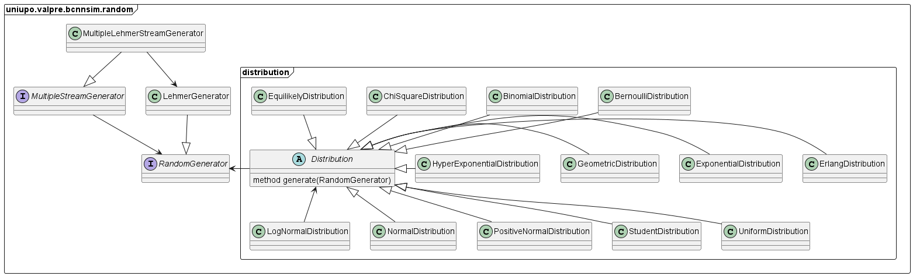
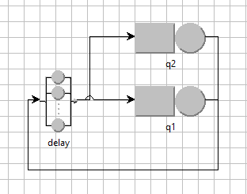
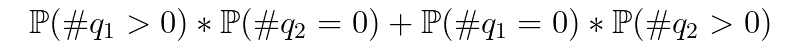

# QNetSim - Simulatore di Reti di Code

### Gabor Galazzo | Valutazione Delle Prestazioni | UPO | 2022/23


QNetSim è uno strumento di simulazione e valutazione di metriche per reti di code realizzato come parte di laboratorio
del corso di Valutazione delle Prestazioni presso l'università degli studi del Piemonte Orientale a.a. 2022/23

## Quick Start

Una volta avviato l'applicativo si aprerà la schermata seguente


#### Network Configuration

1. **Select Model**: Seleziona il file JSON contenente la rete su cui effetuare la simulazione
2. **Reference Station**: Stazione di riferimento per la terminazione

#### Simulation Configuration

3. **Customer for Run**: Numero di clienti serviti prima di terminare la simulazione dalla stazione di riferimento
4. **Num Runs**: Numero di run da effettuare (in parallelo)

#### Evaluation Coefficients

5. **Accuracy**: L'accuratezza in percentuale desiderata per le metriche
6. **Precision Type**: Scelta della precisione se Assoluta o Relativa
7. **Precision**: Precisione dell'accuratezza delle metriche

#### Interface

8. **Run Simulation**: Avvia la simulazione
9. **Network**: Rappresentazione grafica della Rete di Code

Una volta avviata la simulazione comparirà una dinestra con una barra progresso in cui vengono riportate le metriche
generate ad ogni run di simulazione

#### Risultati Run


1. **Barra Progresso**
2. **Node**: Il nodo della rete relativo alla metrica
3. **Metrics**: La metrica valutata dul nodo
4. **Mean**: Il valore medio della metrica sulle più run
5. **SD**: Deviazione Standard della metrica sulle più run
6. **Coefficient**: T COnfidence Interval
7. **Min Runs**: Stima delle run necessarie a raggiungere l'accuracy desiderata con la precision specificata
8. **Accuracy Reached**: Indica se l'accuracy desiderata con tale precisione è stata raggiunta

## Formato Json dei modelli

I json file contengono un JSONObject che descrive la rete.
Ogni Classe del progetto relativa al modello presenta un costruttore che prende in input
un oggetto json.

```json
{
  // Oggetto Principale QueueNetwork
  "class": "uniupo.valpre.bcnnsim.network.QueueNetwork",
  // Indica le classi di clienti disponibili
  "classes": [
    {
      "class": "uniupo.valpre.bcnnsim.network.classes.OpenCustomerClass",
      "name": "c",
      "priority": 0,
      "referenceStation": "source",
      "interArrivalTimeDistribution": {
        "class": "uniupo.valpre.bcnnsim.random.distribution.ExponentialDistribution",
        "mean": 1.0
      }
    }
  ],
  // Indica i Nodi della Rete
  "nodes": [
    {
      // Nodo di tipo "Coda"
      "class": "uniupo.valpre.bcnnsim.network.node.Queue",
      "name": "q1",
      "routingStrategy": {
        "class": "uniupo.valpre.bcnnsim.network.routing.RandomRoutingStrategy"
      },
      "numServer": 2
    },
    {
      // Nodo di tipo "Pozzo"
      "class": "uniupo.valpre.bcnnsim.network.node.Sink",
      "name": "sink"
    },
    {
      // Nodo di tipo "Sorgente"
      "class": "uniupo.valpre.bcnnsim.network.node.Source",
      "name": "source",
      "routingStrategy": {
        "class": "uniupo.valpre.bcnnsim.network.routing.RandomRoutingStrategy"
      }
    }
  ],
  // Indica le distribuzioni per nodo e classe per il routing
  "serviceTimeDistributions": [
    {
      "node": "q1",
      "class": "c",
      "distribution": {
        "class": "uniupo.valpre.bcnnsim.random.distribution.PositiveNormalDistribution",
        "mean": 3.2,
        "sigma": 0.6
      }
    },
    {
      "node": "source",
      "class": "c",
      "distribution": {
        "class": "uniupo.valpre.bcnnsim.random.distribution.ExponentialDistribution",
        "mean": 4.2
      }
    }
  ],
  // Collegamenti tra i nodi
  "links": {
    "q1": [
      "sink"
    ],
    "sink": [],
    "source": [
      "q1"
    ]
  }
}
```

## Scelte implementative

### Package and Class Diagram

### Descrizioni
#### gui
Questo Package contiene i form grafici e le schemate di visualizzazione
#### network
Network è il package che contiene la rappresentazione in oggetti di una rete di code
##### network.class
Contiene i descrittori di Classi di Customer: Open e Closed
##### network.event
Contiene i descrittori di Event: Arrivo e Partenza
##### network.node
Conitene i descrittori dei nodi della rete:
- Source
- Queue
- Delay
- Sink
##### network.routing
Contiene i descrittori delle strategie di Routing
## Gestione dei Generatori di Sequenza Casuali

### Generazione di numeri casuali
Per generare delle sequenza lunghe di numeri casuali si è utilizzato il generatore di **Lehmer** implementato cella classe 
[LehmerGenerator](src/main/java/uniupo/valpre/bcnnsim/random/LehmerGenerator.java)
### Gestione Sequenze lunghe ed indipendenti
Si sono utilizzate le proprietà del generatore di Lehmer per generare 256 Stream indipendenti. 
Il codice è stato implementato nella classe [MultipleLehmerStreamGenerator](src/main/java/uniupo/valpre/bcnnsim/random/MultipleLehmerStreamGenerator.java)
### Implementazione dei campionatori da una distribuzione Nota
All'interno del package distribution sono presenti le implementazioni di generatori di numeri casuali per le principali distribuzioni Note.
Tutte implementano il metodo *generate(RandomGenerator g)* che prende in input un generatore g un uniforme [0,1] ed effettuano le trasformazioni  
Le distribuzioni implementate sono
* [Bernoulli](src/main/java/uniupo/valpre/bcnnsim/random/distribution/BernoulliDistribution.java)
* [Binomial](src/main/java/uniupo/valpre/bcnnsim/random/distribution/BinomialDistribution.java)
* [ChiSquare](src/main/java/uniupo/valpre/bcnnsim/random/distribution/ChiSquareDistribution.java)
* [Equilikely](src/main/java/uniupo/valpre/bcnnsim/random/distribution/EquilikelyDistribution.java)
* [Erlang](src/main/java/uniupo/valpre/bcnnsim/random/distribution/ErlangDistribution.java)
* [Exponential](src/main/java/uniupo/valpre/bcnnsim/random/distribution/ExponentialDistribution.java)
* [Geometric](src/main/java/uniupo/valpre/bcnnsim/random/distribution/GeometricDistribution.java)
* [HyperExponential](src/main/java/uniupo/valpre/bcnnsim/random/distribution/HyperExponentialDistribution.java)
* [LogNormal](src/main/java/uniupo/valpre/bcnnsim/random/distribution/LogNormalDistribution.java)
* [Normal](src/main/java/uniupo/valpre/bcnnsim/random/distribution/NormalDistribution.java)
* [PositiveNormal](src/main/java/uniupo/valpre/bcnnsim/random/distribution/PositiveNormalDistribution.java)
* [Student](src/main/java/uniupo/valpre/bcnnsim/random/distribution/StudentDistribution.java)
* [Uniform](src/main/java/uniupo/valpre/bcnnsim/random/distribution/UniformDistribution.java)

## Implementazione della Simulazione


La procedura di simulazione è implementata nella classe [Simulator](https://github.com/GaborGalazzoUniUPO/jQNet/blob/98a4409a461de6922f50f46f01fd1184a295e2af/src/main/java/uniupo/valpre/bcnnsim/sim/Simulator.java#L35)
e poi nelle varie implementazioni del metodo **manageEvent(Event e)** dei [nodi](https://github.com/GaborGalazzoUniUPO/jQNet/blob/98a4409a461de6922f50f46f01fd1184a295e2af/src/main/java/uniupo/valpre/bcnnsim/network/node/Queue.java#L54) 

## Confronto con Java Modeling Tool
### Modello 1

#### Risultati QNetSim

| node   | metric                                        | mean                 | sd                   | h                     | runNeeded | accuracyReached |
|--------|-----------------------------------------------|----------------------|----------------------|-----------------------|-----------|-----------------|
| q1     | AVG_ARRIVAL_TIME                              | 0.8359918603321144   | 0.034661597211277845 | 0.006912261018648167  | 3         | true            |
| q1     | AVG_QUEUE_TIME                                | 0.054508187095230795 | 0.011380061998124509 | 0.00226942683742921   | 69        | true            |
| q1     | **(2) AVG_RESPONSE_TIME**                     | 1.6548613169709625   | 0.016777432905908347 | 0.0033457775982337636 | 1         | true            |
| q1     | AVG_SERVICE_TIME                              | 1.600353129875731    | 0.012680609679604707 | 0.0025287837558883464 | 1         | true            |
| q1     | MAX_NUMBER_OF_CUSTOMERS_IN_QUEUE              | 3.7                  | 0.8102873913406634   | 0.16158857062835547   | 76        | true            |
| q1     | MEAN_NUMBER_OF_CUSTOMERS_IN_QUEUE             | 0.03656382255726413  | 0.008095437259305414 | 0.0016144026790029682 | 78        | true            |
| q1     | **(1) MEAN_NUMBER_OF_CUSTOMERS_IN_THIS_NODE** | 1.1072750966131313   | 0.038189448783527216 | 0.007615789790095019  | 2         | true            |
| q1     | MEAN_NUMBER_OF_CUSTOMERS_SERVED               | 1.0707112740558666   | 0.03360483898276484  | 0.006701520911533038  | 2         | true            |
| q1     | **(2) NODE_THROUGHPUT**                       | 0.6686158151197819   | 0.020635501541602503 | 0.004115158688067121  | 2         | true            |
| q1     | NUMBER_OF_CUSTOMERS_ARRIVED                   | 1002.13              | 1.1776967763264425   | 0.23485783038700211   | 1         | true            |
| q1     | NUMBER_OF_CUSTOMERS_SERVED                    | 1001.0               | 0.0                  | 0.0                   | 0         | true            |
| q1     | **(3) SERVER_UTILIZATION_0**                  | 0.35670749593602763  | 0.011818366449446047 | 0.0023568340839765236 | 2         | true            |
| q1     | **(3) SERVER_UTILIZATION_1**                  | 0.3571333333253587   | 0.011906676660536405 | 0.0023744450216937807 | 2         | true            |
| q1     | **(3) SERVER_UTILIZATION_2**                  | 0.3568704447944804   | 0.011710291297019698 | 0.0023352815958252266 | 2         | true            |
| q1     | SIMULATION_RUN_LENGTH                         | 1498.5460019007285   | 46.62676880604038    |                       |           | true            |
| sink   | NUMBER_OF_CUSTOMERS_ARRIVED                   | 1000.0               | 0.0                  | 0.0                   | 0         | true            |
| sink   | NUMBER_OF_CUSTOMERS_SERVED                    | 1000.0               | 0.0                  | 0.0                   | 0         | true            |
| source | NUMBER_OF_CUSTOMERS_ARRIVED                   | 1002.13              | 1.1776967763264425   | 0.23485783038700211   | 1         | true            |
| source | NUMBER_OF_CUSTOMERS_SERVED                    | 1002.13              | 1.1776967763264425   | 0.23485783038700211   | 1         | false           |

#### Risultati JMT
1. 
2. 
3. 
4. 

## Model2

### Risultati QNetSim
| node  | metric                                        | mean               | sd                    | h                     | runNeeded | accuracyReached |
|-------|-----------------------------------------------|--------------------|-----------------------|-----------------------|-----------|-----------------|
| q1    | AVG_ARRIVAL_TIME                              | 0.3306857561258932 | 0.002514597341384426  | 6.637623686458647E-4  | 1         | true            |
| q1    | **(2) AVG_QUEUE_TIME**                        | 76.60787384107893  | 0.18639335091945777   | 0.04920107488780845   | 1         | true            |
| q1    | **(3) AVG_RESPONSE_TIME**                     | 78.19406663550602  | 0.19020469989093192   | 0.05020713258913762   | 1         | true            |
| q1    | AVG_SERVICE_TIME                              | 1.586192794427123  | 0.003829442839691542  | 0.0010108338253742766 | 1         | true            |
| q1    | MAX_NUMBER_OF_CUSTOMERS_IN_QUEUE              | 98.0               | 0.0                   | 0.0                   | 0         | true            |
| q1    | MEAN_NUMBER_OF_CUSTOMERS_IN_QUEUE             | 96.11457361252069  | 0.018422431673610865  | 0.0048628528642125635 | 1         | true            |
| q1    | **(1) MEAN_NUMBER_OF_CUSTOMERS_IN_THIS_NODE** | 98.1145685792136   | 0.018422811955522346  | 0.00486295324482546   | 1         | true            |
| q1    | MEAN_NUMBER_OF_CUSTOMERS_SERVED               | 1.9999949666929109 | 3.964376969851272E-6  | 1.0464515349661756E-6 | 1         | true            |
| q1    | **(4) NODE_THROUGHPUT**                       | 1.2486747239485605 | 0.0029834722432685733 | 7.87528313336586E-4   | 1         | true            |
| q1    | NUMBER_OF_CUSTOMERS_ARRIVED                   | 10098.48           | 1.0490977364412046    | 0.27692369948098683   | 1         | true            |
| q1    | NUMBER_OF_CUSTOMERS_SERVED                    | 10001.0            | 0.0                   | 0.0                   | 0         | true            |
| q1    | **(5) SERVER_UTILIZATION_0**                  | 0.9999982632547841 | 1.7679022902752964E-6 | 4.6666199491069256E-7 | 1         | true            |
| q1    | **(5) SERVER_UTILIZATION_1**                  | 0.9999967034380837 | 2.4110698883542543E-6 | 6.364348811343464E-7  | 1         | true            |
| q1    | SIMULATION_RUN_LENGTH                         | 8009.336918015786  | 19.151086763060583    |                       |           | true            |
| delay | AVG_ARRIVAL_TIME                              | 0.465569133367714  | 0.0027003292250433845 | 7.127888402012094E-4  | 1         | true            |
| delay | AVG_DELAY_TIME                                | 1.495097376829722  | 0.014538170226531177  | 0.0038375489174844674 | 1         | true            |
| delay | **(1) MEAN_NUMBER_OF_CUSTOMERS_IN_THIS_NODE** | 1.8854541846896395 | 0.01843046608256624   | 0.004864973656369272  | 1         | true            |
| delay | NODE_THROUGHPUT                               | 1.2609413934777949 | 0.003027643727162656  | 7.991879807885514E-4  | 1         | true            |
| delay | NUMBER_OF_CUSTOMERS_ARRIVED                   | 10100.0            | 0.0                   | 0.0                   | 0         | true            |
| delay | NUMBER_OF_CUSTOMERS_SERVED                    | 10098.48           | 1.0490977364412046    | 0.27692369948098683   | 1         | true            |
| delay | SIMULATION_RUN_LENGTH                         | 8008.728672071056  | 19.198618284678286    |                       |           | true            |

### Risultati JMT
1. 
2. 
3. 
4. 
5. 

## Model3


### Risultati QNetSim
| node  | metric                                        | mean               | sd                    | h                     | runNeeded | accuracyReached |
|-------|-----------------------------------------------|--------------------|-----------------------|-----------------------|-----------|-----------------|
| q1    | AVG_ARRIVAL_TIME                              | 1.2120127925478483 | 0.026999169886946235  | 0.004977648054773501  | 4         | true            |
| q1    | **(2) AVG_QUEUE_TIME**                        | 2.1310417477539674 | 0.2480112508215904    | 0.045724099125392145  | 102       | true            |
| q1    | **(3) AVG_RESPONSE_TIME**                     | 3.731748462878743  | 0.2482546768558466    | 0.045768977880219434  | 34        | true            |
| q1    | AVG_SERVICE_TIME                              | 1.6007067151247762 | 0.003767158953005468  | 6.945247395741752E-4  | 1         | true            |
| q1    | MAX_NUMBER_OF_CUSTOMERS_IN_QUEUE              | 39.325             | 4.684988858366159     | 0.8637386177104978    | 107       | true            |
| q1    | MEAN_NUMBER_OF_CUSTOMERS_IN_QUEUE             | 0.8920057991286177 | 0.10912218784325006   | 0.020118094309010556  | 113       | true            |
| q1    | **(1) MEAN_NUMBER_OF_CUSTOMERS_IN_THIS_NODE** | 1.5616330573264616 | 0.11363096431147043   | 0.02094934588120414   | 40        | true            |
| q1    | MEAN_NUMBER_OF_CUSTOMERS_SERVED               | 0.6696272581978426 | 0.008727763744619603  | 0.0016090767385753206 | 2         | true            |
| q1    | **(5) NODE_THROUGHPUT**                       | 0.4182908433120136 | 0.005451718006275649  | 0.001005095106358508  | 2         | true            |
| q1    | NUMBER_OF_CUSTOMERS_ARRIVED                   | 10002.48           | 1.704148057832732     | 0.31418185450280806   | 1         | true            |
| q1    | NUMBER_OF_CUSTOMERS_SERVED                    | 10001.0            | 0.0                   | 0.0                   | 0         | true            |
| q1    | **(4) SERVER_UTILIZATION_0**                  | 0.6696272581978416 | 0.008727763744619981  | 0.0016090767385753906 | 2         | true            |
| q1    | SIMULATION_RUN_LENGTH                         | 23913.233961428792 | 311.001795474723      |                       |           | true            |
| q2    | AVG_ARRIVAL_TIME                              | 0.579064144930426  | 0.0037610511336805537 | 6.933986836580537E-4  | 1         | true            |
| q2    | **(2) AVG_QUEUE_TIME**                        | 152.92973973326568 | 0.3589360071066475    | 0.06617452036650942   | 1         | true            |
| q2    | **(3) AVG_RESPONSE_TIME**                     | 154.51973015028977 | 0.3615270057410384    | 0.06665220465704134   | 1         | true            |
| q2    | AVG_SERVICE_TIME                              | 1.5899904170241752 | 0.003035395678533158  | 5.596146643761645E-4  | 1         | true            |
| q2    | MAX_NUMBER_OF_CUSTOMERS_IN_QUEUE              | 99.0               | 0.0                   | 0.0                   | 0         | true            |
| q2    | MEAN_NUMBER_OF_CUSTOMERS_IN_QUEUE             | 95.86857295949507  | 0.11929803680200705   | 0.02199414438711741   | 1         | true            |
| q2    | **(1) MEAN_NUMBER_OF_CUSTOMERS_IN_THIS_NODE** | 96.86857189253642  | 0.11929809165971839   | 0.021994154500849843  | 1         | true            |
| q2    | MEAN_NUMBER_OF_CUSTOMERS_SERVED               | 0.9999989330413177 | 1.1480550658466973E-6 | 2.1165888022533693E-7 | 1         | true            |
| q2    | NODE_THROUGHPUT                               | 0.6248744261484463 | 0.0012041990025285078 | 2.2200974502531947E-4 | 1         | true            |
| q2    | NUMBER_OF_CUSTOMERS_ARRIVED                   | 15038.685          | 195.60668611595653    | 36.062636174474946    | 2         | true            |
| q2    | NUMBER_OF_CUSTOMERS_SERVED                    | 14942.36           | 195.64530617713714    | 36.069756284953       | 2         | true            |
| q2    | **(4) SERVER_UTILIZATION_0**                  | 0.9999989330413999 | 1.148055098799914E-6  | 2.1165888630069094E-7 | 1         | true            |
| q2    | SIMULATION_RUN_LENGTH                         | 23912.59888137212  | 311.015128015716      |                       |           | true            |
| delay | AVG_ARRIVAL_TIME                              | 0.5698142157795096 | 0.003906144989051238  | 7.201486226365353E-4  | 1         | true            |
| delay | AVG_DELAY_TIME                                | 1.4989092029586708 | 0.009713994458240283  | 0.0017909011951703863 | 1         | true            |
| delay | **(1) MEAN_NUMBER_OF_CUSTOMERS_IN_THIS_NODE** | 1.5698194097565394 | 0.013729036772609924  | 0.002531126455785457  | 1         | true            |
| delay | **(5) NODE_THROUGHPUT**                       | 1.0472610465756695 | 0.0056730100650837275 | 0.0010458931749908116 | 1         | true            |
| delay | NUMBER_OF_CUSTOMERS_ARRIVED                   | 25042.36           | 195.64530617713714    | 36.069756284953       | 1         | true            |
| delay | NUMBER_OF_CUSTOMERS_SERVED                    | 25041.165          | 195.63720853101808    | 36.06826337859248     | 1         | true            |
| delay | SIMULATION_RUN_LENGTH                         | 23912.738840540886 | 311.01380418574746    |                       |           | true            |

#### Probabilità che una stazione sia vuota e l'altra con almento di un servitore:



### Risultati JMT
1. 
2. 
3. 
4. 
5. 