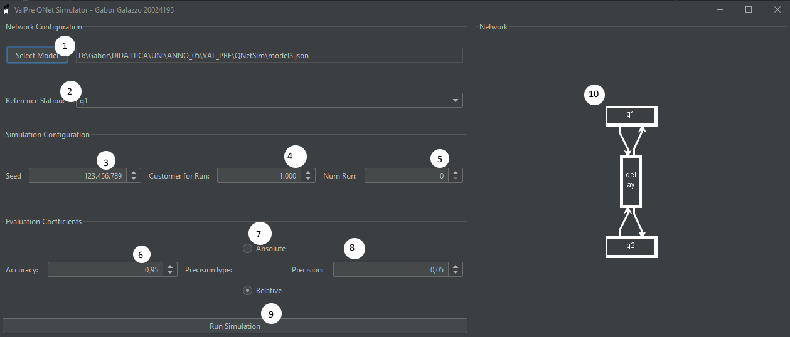

# QNetSim - Simulatore di Reti di Code

### Gabor Galazzo | Valutazione Delle Prestazioni | UPO | 2022/23


QNetSim è uno strumento di simulazione e valutazione di metriche per reti di code realizzato come parte di laboratorio
del corso di Valutazione delle Prestazioni presso l'università degli studi del Piemonte Orientale a.a. 2022/23

## Quick Start

Una volta avviato l'applicativo si aprerà la schermata seguente


#### Network Configuration

1. **Select Model**: Seleziona il file JSON contenente la rete su cui effetuare la simulazione
2. **Reference Station**: Stazione di riferimento per la terminazione

#### Simulation Configuration

3. **Customer for Run**: Numero di clienti serviti prima di terminare la simulazione dalla stazione di riferimento
4. **Num Runs**: Numero di run da effettuare (in parallelo)

#### Evaluation Coefficients

5. **Accuracy**: L'accuratezza in percentuale desiderata per le metriche
6. **Precision Type**: Scelta della precisione se Assoluta o Relativa
7. **Precision**: Precisione dell'accuratezza delle metriche

#### Interface

8. **Run Simulation**: Avvia la simulazione
9. **Network**: Rappresentazione grafica della Rete di Code

Una volta avviata la simulazione comparirà una dinestra con una barra progresso in cui vengono riportate le metriche
generate ad ogni run di simulazione

#### Risultati Run


1. **Barra Progresso**
2. **Node**: Il nodo della rete relativo alla metrica
3. **Metrics**: La metrica valutata dul nodo
4. **Mean**: Il valore medio della metrica sulle più run
5. **SD**: Deviazione Standard della metrica sulle più run
6. **Coefficient**: T COnfidence Interval
7. **Min Runs**: Stima delle run necessarie a raggiungere l'accuracy desiderata con la precision specificata
8. **Accuracy Reached**: Indica se l'accuracy desiderata con tale precisione è stata raggiunta

## Formato Json dei modelli

I json file contengono un JSONObject che descrive la rete.
Ogni Classe del progetto relativa al modello presenta un costruttore che prende in input
un oggetto json.

```json
{
  // Oggetto Principale QueueNetwork
  "class": "uniupo.valpre.bcnnsim.network.QueueNetwork",
  // Indica le classi di clienti disponibili
  "classes": [
    {
      "class": "uniupo.valpre.bcnnsim.network.classes.OpenCustomerClass",
      "name": "c",
      "priority": 0,
      "referenceStation": "source",
      "interArrivalTimeDistribution": {
        "class": "uniupo.valpre.bcnnsim.random.distribution.ExponentialDistribution",
        "mean": 1.0
      }
    }
  ],
  // Indica i Nodi della Rete
  "nodes": [
    {
      // Nodo di tipo "Coda"
      "class": "uniupo.valpre.bcnnsim.network.node.Queue",
      "name": "q1",
      "routingStrategy": {
        "class": "uniupo.valpre.bcnnsim.network.routing.RandomRoutingStrategy"
      },
      "numServer": 2
    },
    {
      // Nodo di tipo "Pozzo"
      "class": "uniupo.valpre.bcnnsim.network.node.Sink",
      "name": "sink"
    },
    {
      // Nodo di tipo "Sorgente"
      "class": "uniupo.valpre.bcnnsim.network.node.Source",
      "name": "source",
      "routingStrategy": {
        "class": "uniupo.valpre.bcnnsim.network.routing.RandomRoutingStrategy"
      }
    }
  ],
  // Indica le distribuzioni per nodo e classe per il routing
  "serviceTimeDistributions": [
    {
      "node": "q1",
      "class": "c",
      "distribution": {
        "class": "uniupo.valpre.bcnnsim.random.distribution.PositiveNormalDistribution",
        "mean": 3.2,
        "sigma": 0.6
      }
    },
    {
      "node": "source",
      "class": "c",
      "distribution": {
        "class": "uniupo.valpre.bcnnsim.random.distribution.ExponentialDistribution",
        "mean": 4.2
      }
    }
  ],
  // Collegamenti tra i nodi
  "links": {
    "q1": [
      "sink"
    ],
    "sink": [],
    "source": [
      "q1"
    ]
  }
}
```

## Scelte implementative

### Package Diagram


### Descrizioni
#### gui
Questo Package contiene i form grafici e le schemate di visualizzazione
#### network
Network è il package che contiene la rappresentazione in oggetti di una rete di code
##### network.class
Contiene i descrittori di Classi di Customer: Open e Closed
##### network.event
Contiene i descrittori di Event: Arrivo e Partenza
##### network.node
Conitene i descrittori dei nodi della rete:
- Source
- Queue
- Delay
- Sink
##### network.routing
Contiene i descrittori delle strategie di Routing
## Gestione dei Generatori di Sequenza Casuali

### Generazione di numeri casuali
Per generare delle sequenza lunghe di numeri casuali si è utilizzato il generatore di **Lehmer** implementato cella classe 
[LehmerGenerator](src/main/java/uniupo/valpre/bcnnsim/random/LehmerGenerator.java)
### Gestione Sequenze lunghe ed indipendenti
Si sono utilizzate le proprietà del generatore di Lehmer per generare 256 Stream indipendenti. 
Il codice è stato implementato nella classe [MultipleLehmerStreamGenerator](src/main/java/uniupo/valpre/bcnnsim/random/MultipleLehmerStreamGenerator.java)
### Implementazione dei campionatori da una distribuzione Nota
All'interno del package distribution sono presenti le implementazioni di generatori di numeri casuali per le principali distribuzioni Note.
Tutte implementano il metodo *generate(RandomGenerator g)* che prende in input un generatore g un uniforme [0,1] ed effettuano le trasformazioni  
Le distribuzioni implementate sono
* [Bernoulli](src/main/java/uniupo/valpre/bcnnsim/random/distribution/BernoulliDistribution.java)
* [Binomial](src/main/java/uniupo/valpre/bcnnsim/random/distribution/BinomialDistribution.java)
* [ChiSquare](src/main/java/uniupo/valpre/bcnnsim/random/distribution/ChiSquareDistribution.java)
* [Equilikely](src/main/java/uniupo/valpre/bcnnsim/random/distribution/EquilikelyDistribution.java)
* [Erlang](src/main/java/uniupo/valpre/bcnnsim/random/distribution/ErlangDistribution.java)
* [Exponential](src/main/java/uniupo/valpre/bcnnsim/random/distribution/ExponentialDistribution.java)
* [Geometric](src/main/java/uniupo/valpre/bcnnsim/random/distribution/GeometricDistribution.java)
* [HyperExponential](src/main/java/uniupo/valpre/bcnnsim/random/distribution/HyperExponentialDistribution.java)
* [LogNormal](src/main/java/uniupo/valpre/bcnnsim/random/distribution/LogNormalDistribution.java)
* [Normal](src/main/java/uniupo/valpre/bcnnsim/random/distribution/NormalDistribution.java)
* [PositiveNormal](src/main/java/uniupo/valpre/bcnnsim/random/distribution/PositiveNormalDistribution.java)
* [Student](src/main/java/uniupo/valpre/bcnnsim/random/distribution/StudentDistribution.java)
* [Uniform](src/main/java/uniupo/valpre/bcnnsim/random/distribution/UniformDistribution.java)

## Implementazione della Simulazione


La procedura di simulazione è implementata nella classe [Simulator](https://github.com/GaborGalazzoUniUPO/jQNet/blob/98a4409a461de6922f50f46f01fd1184a295e2af/src/main/java/uniupo/valpre/bcnnsim/sim/Simulator.java#L35)
e poi nelle varie implementazioni del metodo **manageEvent(Event e)** dei [nodi](https://github.com/GaborGalazzoUniUPO/jQNet/blob/98a4409a461de6922f50f46f01fd1184a295e2af/src/main/java/uniupo/valpre/bcnnsim/network/node/Queue.java#L54) 

## Confronto con Java Modeling Tool
