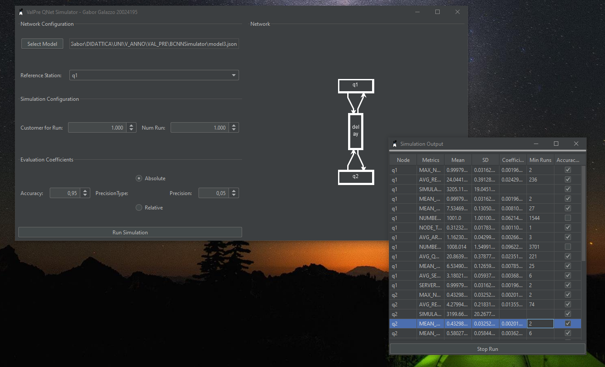
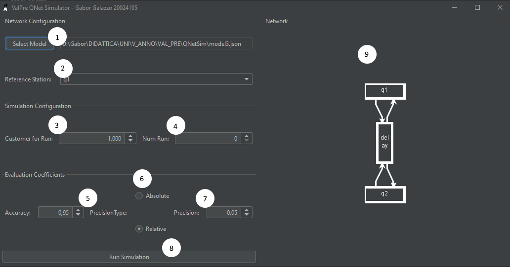
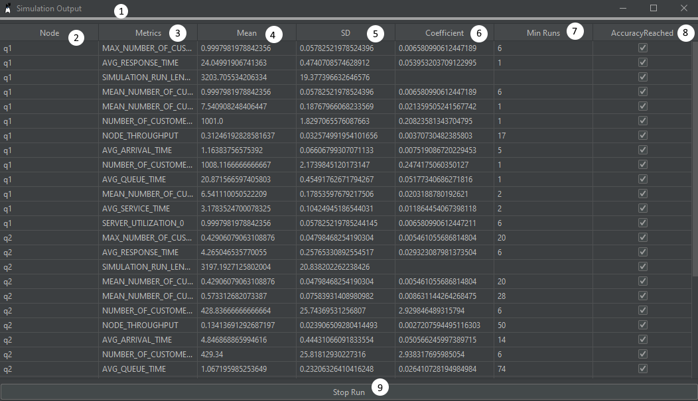

# QNetSim - Simulatore di Reti di Code
### Gabor Galazzo | Valutazione Delle Prestazioni | UPO | 2022/23



QNetSim è uno strumento di simulazione e valutazione di metriche per reti di code realizzato come parte di laboratorio del corso di Valutazione delle Prestazioni presso l'università degli studi del Piemonte Orientale a.a. 2022/23

## Quick Start
Una volta avviato l'applicativo si aprerà la schermata seguente

#### Network Configuration
1. **Select Model**: Seleziona il file JSON contenente la rete su cui effetuare la simulazione
2. **Reference Station**: Stazione di riferimento per la terminazione
#### Simulation Configuration
3. **Customer for Run**: Numero di clienti serviti prima di terminare la simulazione dalla stazione di riferimento
4. **Num Runs**: Numero di run da effettuare (in parallelo)
#### Evaluation Coefficients
5. **Accuracy**: L'accuratezza in percentuale desiderata per le metriche
6. **Precision Type**: Scelta della precisione se Assoluta o Relativa
7. **Precision**: Precisione dell'accuratezza delle metriche
#### Interface
8. **Run Simulation**: Avvia la simulazione
9. **Network**: Rappresentazione grafica della Rete di Code

Una volta avviata la simulazione comparirà una dinestra con una barra progresso in cui vengono riportate le metriche generate ad ogni run di simulazione

#### Risultati Run

1. **Barra Progresso**
2. **Node**: Il nodo della rete relativo alla metrica
3. **Metrics**: La metrica valutata dul nodo
4. **Mean**: Il valore medio della metrica sulle più run
5. **SD**: Deviazione Standard della metrica sulle più run
6. **Coefficient**: T COnfidence Interval
7. **Min Runs**: Stima delle run necessarie a raggiungere l'accuracy desiderata con la precision specificata
8. **Accuracy Reached**: Indica se l'accuracy desiderata con tale precisione è stata raggiunta

## Formato Json dei modelli
I json file contengono un JSONObject che descrive la rete.
Ogni Classe del progetto relativa al modello presenta un costruttore che prende in input
un oggetto json.
```json
{
  // Oggetto Principale QueueNetwork
  "class": "uniupo.valpre.bcnnsim.network.QueueNetwork",
  // Indica le classi di clienti disponibili
  "classes": [
    {
      "class": "uniupo.valpre.bcnnsim.network.classes.OpenCustomerClass",
      "name": "c",
      "priority": 0,
      "referenceStation": "source",
      "interArrivalTimeDistribution": {
        "class": "uniupo.valpre.bcnnsim.random.distribution.ExponentialDistribution",
        "mean": 1.0
      }
    }
  ],
  // Indica i Nodi della Rete
  "nodes": [
    {
      // Nodo di tipo "Coda"
      "class": "uniupo.valpre.bcnnsim.network.node.Queue",
      "name": "q1",
      "routingStrategy": {
        "class": "uniupo.valpre.bcnnsim.network.routing.RandomRoutingStrategy"
      },
      "numServer": 2
    },
    {
      // Nodo di tipo "Pozzo"
      "class": "uniupo.valpre.bcnnsim.network.node.Sink",
      "name": "sink"
    },
    {
      // Nodo di tipo "Sorgente"
      "class": "uniupo.valpre.bcnnsim.network.node.Source",
      "name": "source",
      "routingStrategy": {
        "class": "uniupo.valpre.bcnnsim.network.routing.RandomRoutingStrategy"
      }
    }
  ],
  // Indica le distribuzioni per nodo e classe per il routing
  "serviceTimeDistributions": [
    {
      "node": "q1",
      "class": "c",
      "distribution": {
        "class": "uniupo.valpre.bcnnsim.random.distribution.PositiveNormalDistribution",
        "mean": 3.2,
        "sigma": 0.6
      }
    },
    {
      "node": "source",
      "class": "c",
      "distribution": {
        "class": "uniupo.valpre.bcnnsim.random.distribution.ExponentialDistribution",
        "mean": 4.2
      }
    }
  ],
  // Collegamenti tra i nodi
  "links": {
    "q1": [
      "sink"
    ],
    "sink": [],
    "source": [
      "q1"
    ]
  }
}
```


